# Game Tracker App 2026🎮 🏆 🐍 📘

**_"Primo vero progetto di sviluppo"_**

Benvenuto nel mio progetto Github!🎯 **Sono Giovanni**, studente DevOps, amante dell'informatica e di ogni tecnologia esistente. 

Questa è un'app per tenere traccia dei videogiochi che gioco, con un sistema di achievement ispirato ai trofei PlayStation. L'ho costruita come progetto per un portfolio.
 
🔗 **Demo live:** https://gametracker-frontend-wpzb.onrender.com
 
🔗 **API backend:** https://gametracker-backend-o9ym.onrender.com/docs
 
> Gira su piano gratuito Render: al primo accesso può metterci 30-60 secondi a "svegliarsi", poi va normalmente.

## Cosa fa

- Registrazione e login con autenticazione JWT
- Ricerca giochi tramite l'API di IGDB (Internet Game Database)
- Libreria personale: aggiungi giochi, segna lo stato (da giocare / in corso / completato), ore giocate, voto
- Achievement che si sbloccano automaticamente in base a quello che fai nella libreria (tipo: aggiungi il primo gioco, completane 10, gioca a 5 generi diversi...)

 
cmd Backend - Il backend FastAPI avviato con uvicorn

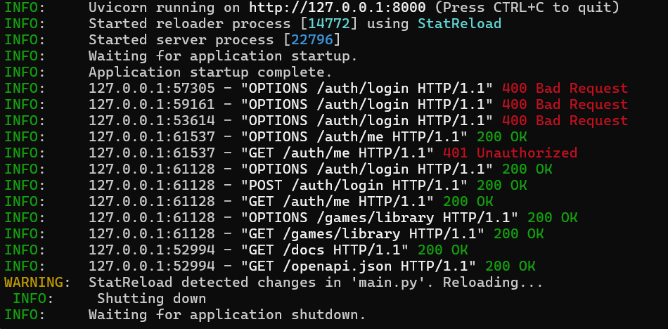

cmd Frontend - Il frontend Vite in modalità sviluppo
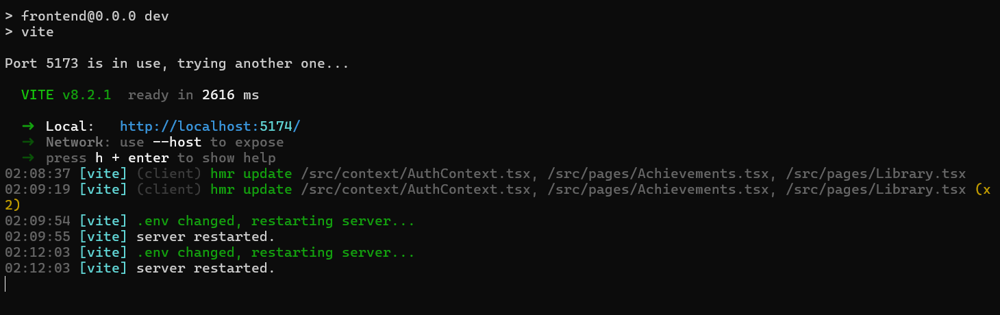

PostgreSQL - Connessione al database dentro il container
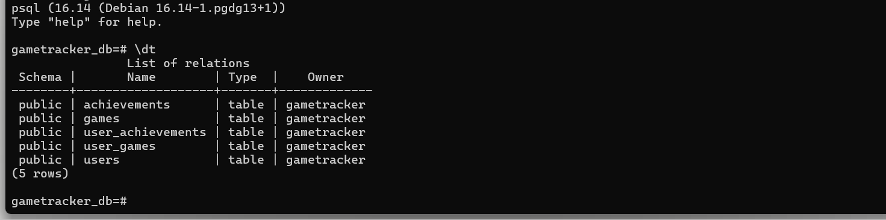

Database - Le tabelle create a partire dai modelli
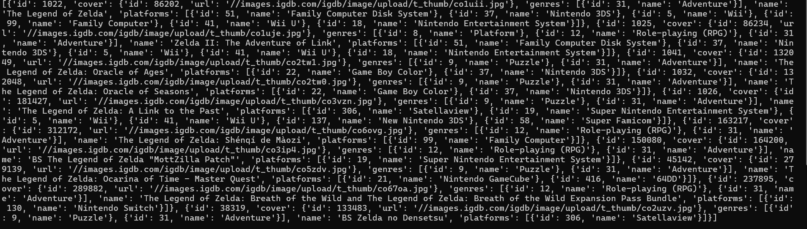

Docker - I tre container (frontend, backend, database) in esecuzione insieme
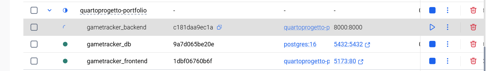

Twitch Developers - L'app registrata per ottenere Client ID e Client Secret
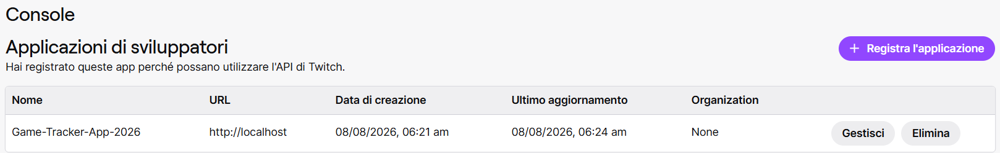

SwaggerUI - Gli endpoint disponibili, divisi per Authentication, Games, Achievements e schema dei dati che ogni endpoint si aspetta in ingresso/uscita
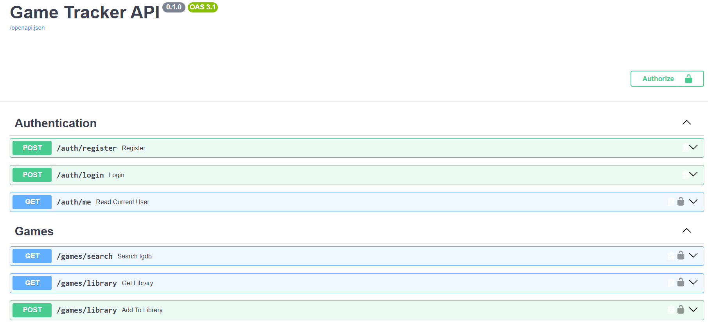
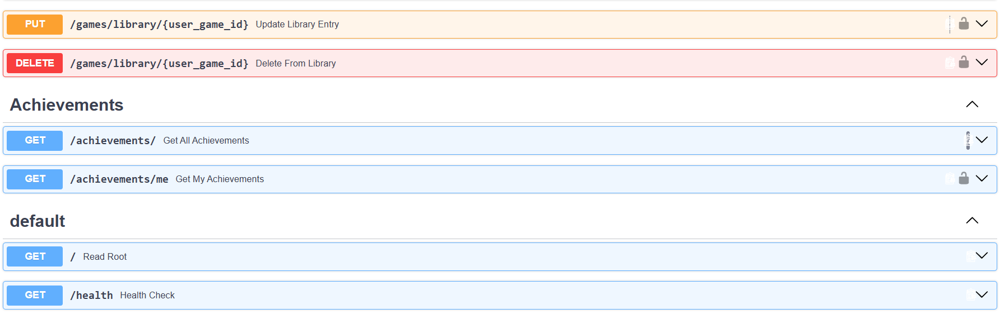

Render - I tre servizi live, ognuno deployato e monitorato indipendentemente
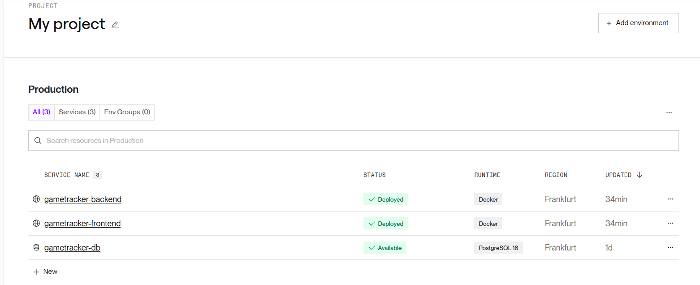

Game Tracker - La libreria personale, con i giochi aggiunti e il loro stato
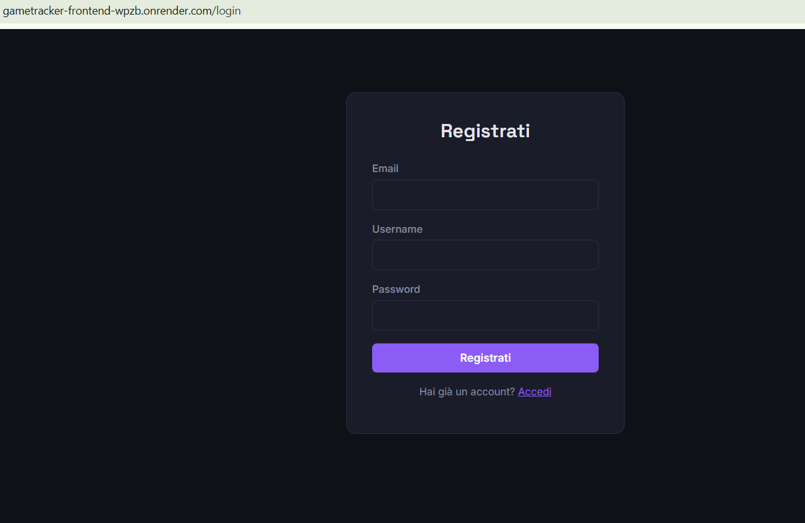
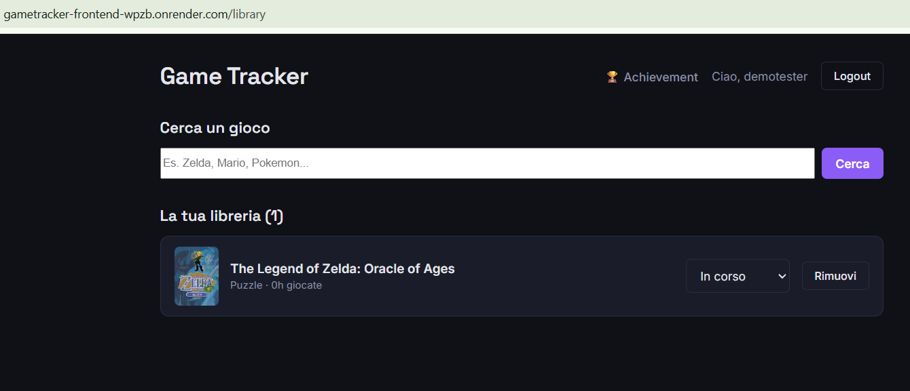

Achivement - trofei si sbloccano da soli quando raggiungi le condizioni richieste
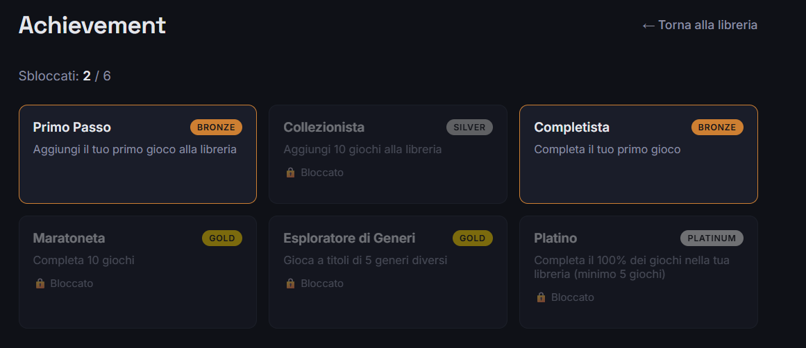

## Stack

**Backend:** Python, FastAPI, SQLAlchemy, PostgreSQL
**Frontend:** React, TypeScript
**Infrastruttura:** Docker, Docker Compose, GitHub Actions per CI/CD
**Deploy:** Render

## Perché questo stack

Ho deciso di seguire le ultime tecnologie che ho appreso e più utilizzate come: React/TypeScript, Python/FastAPI, PostgreSQL, SQLAlchemy e Docker, quindi ci  ho costruito attorno il progetto invece di usare quello che magari mi avrebbe fatto risparmiare tempo.

## Come è fatto sotto

Il pezzo che mi è piaciuto di più costruire è il sistema di achievement: ogni volta che aggiungi o aggiorni un gioco nella libreria, il backend controlla in automatico se hai sbloccato qualche trofeo, confrontando le tue statistiche (giochi aggiunti, completati, generi diversi giocati) con le condizioni salvate nel database. Niente hardcoded — se un giorno voglio aggiungere un nuovo achievement basta inserire una riga nel database.

## Far girare il progetto in locale
Serve Docker installato. Poi:

- > git clone https://github.com/IlGiocatore93/game-tracker-app.git
- > cd game-tracker-app

Crea un file .env nella root con:

  
- SECRET_KEY=una_stringa_casuale_lunga
- IGDB_CLIENT_ID=il_tuo_client_id
- IGDB_CLIENT_SECRET=il_tuo_client_secret

(Il Client ID/Secret di IGDB si ottengono registrando un'app su dev.twitch.tv, è gratis.)

Poi:

docker compose up --build

- > Frontend su localhost:5173
- > backend su localhost:8000 (documentazione API su localhost:8000/docs).

  ## Deploy

Il progetto è online su Render, con tre servizi separati e indipendenti:

- > Database — PostgreSQL, piano gratuito
- > Backend — Web Service Docker, build automatica dal Dockerfile in Backend/
- > Frontend — Web Service Docker, build multi-stage (Node per la build, Nginx per servire i file statici)

- Ogni push su main triggera automaticamente un nuovo deploy su entrambi i servizi (backend e frontend), grazie al collegamento diretto tra Render e il repository GitHub.
- Le variabili d'ambiente (connessione al database, chiavi IGDB, secret JWT, URL del backend per il frontend) sono configurate direttamente nella dashboard di Render, non nel codice.

## Comandi utili

Un promemoria dei comandi che uso più spesso lavorando su questo progetto.

## Docker

- > docker compose up --build     # avvia tutto e crea (db + backend + frontend)
- > docker compose down           # ferma e rimuove i container
- > docker ps                     # vedere i container attivi

## Database (dentro il container) -- PostgreSQL / SQLAlchemy

- docker exec -it gametracker_db psql -U gametracker -d gametracker_db

Una volta dentro:

- > \dt                          -- lista tabelle
- > \d nome_tabella               -- struttura di una tabella
- > SELECT * FROM nome_tabella;   -- vedere i dati
- > \q                            -- uscire

## Backend (Python)

- cd Backend
- venv\Scripts\activate          # Windows
- pip install -r requirements.txt
- pip freeze > requirements.txt  # dopo aver installato una nuova libreria
- uvicorn main:app --reload      # avvio in locale senza Docker

## Frontend (Node)

- cd Frontend
- npm install
- npm run dev                    # avvio in locale senza Docker
- npm run build                  # build di produzione

## Git

- > git status
- > git add .
- > git commit -m "descrizione"
- > git push

## Cosa manca / prossimi passi

Il progetto è funzionante end-to-end ma ci sono un po' di cose che vorrei aggiungere quando ho tempo:
- Un sistema di missioni che sbloccano progressivamente sezioni dell'app (progettato ma tagliato per rispettare i tempi)
- Pipeline CI più completa, con un database di test invece del solo controllo di sintassi
- Un sito portfolio a parte che raccoglie questo e altri progetti

  
🤝 Vuoi contribuire e migliorare il progetto?💭 Apri una Issue o una Pull Request su Github!💡

 

Licenza: MIT - Libero di esplorare, migliorare e condividere.

 

🧑‍💻 Creato da: [Giovanni](https://github.com/IlGiocatore93)

 

🤙 Se ti è piaciuto il progetto, lascia una ✨ su GitHub!🌐
